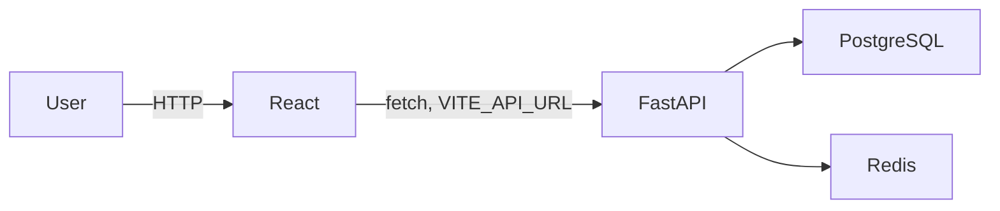
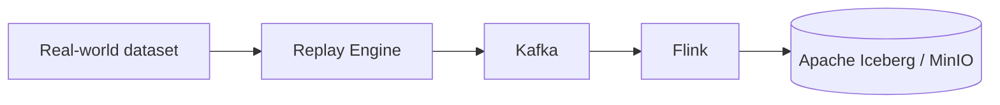

# IceStream — System Architecture (Day 1)

## 1. Overview

IceStream is a real-time lakehouse observability platform. It ingests a
stream of e-commerce order events, processes them through Flink, validates
them against a data-quality engine, and routes good data into an Iceberg
lakehouse (backed by MinIO) while quarantining bad data into a dead-letter
queue. A FastAPI backend exposes this state to a React dashboard over REST
and (later) WebSockets.

This document describes the architecture as scaffolded on Day 1. Components
marked "(future)" are structurally reserved but not yet implemented.

## 2. Service Responsibilities

| Service | Responsibility | Day 1 status |
|---|---|---|
| Kafka | Durable event log for raw and processed order events | Running, topics bootstrapped |
| Flink | Stream processing (validation, enrichment, routing) | Cluster running, no jobs yet |
| Data Quality Engine | Rule-based validation of streaming records | Directory reserved (future) |
| Iceberg | ACID table format for the lakehouse | Not yet configured (future) |
| MinIO | S3-compatible object storage backing Iceberg | Running, warehouse bucket created |
| PostgreSQL | Application metadata store (and future Iceberg catalog) | Running, connectivity verified |
| Redis | Cache / future pub-sub backplane for WebSockets | Running, connectivity verified |
| FastAPI | Backend API, health checks, future business endpoints | Running, `/`, `/health` implemented |
| React | Dashboard UI | Running, bootstrap page only |

## 3. Data Flow

### Control-plane / request path (implemented today)

### Streaming data path (future — structure reserved today)

## 4. Network Architecture

All services run on a single dedicated Docker bridge network,
`icestream-network`. Services address each other by Docker service name —
never by host IP or `localhost`:

- `postgres:5432`
- `redis:6379`
- `kafka:9092` (internal) / `localhost:29092` (host access)
- `minio:9000` (S3 API) / `minio:9001` (console)
- `flink-jobmanager:8081`

Only the ports a human or external tool needs to reach directly are
published to the host (see the README's Service URLs table). Inter-service
traffic never leaves the Docker network.

## 5. Future Iceberg Architecture

Planned (not yet implemented):

- MinIO bucket `icestream-warehouse` as the S3-compatible warehouse root
  (already created on Day 1 so the path is ready).
- A JDBC or REST Iceberg catalog, most likely backed by the existing
  PostgreSQL instance, to avoid introducing an extra catalog service.
- Two logical tables: `orders_valid` (good data) and `orders_dlq` (quarantined
  data), enabling snapshot/time-travel queries for incident investigation.

## 6. Future Kafka / Flink Architecture

Planned (not yet implemented):

- A **Replay Engine** (Python) that reads a static real-world dataset and
  republishes it to `orders.raw` at a configurable rate, simulating a live
  stream.
- A **Flink job** that consumes `orders.raw`, applies data-quality rules,
  and emits to `orders.valid` / `orders.invalid` accordingly, with a
  circuit-breaker mechanism that can pause the pipeline under sustained
  quality degradation.
- Bootstrapped topics (already created on Day 1): `orders.raw`,
  `orders.valid`, `orders.invalid`, `orders.dlq`, `schema.events`,
  `quality.events`, `incidents`.

## 7. Frontend / Backend Architecture

- **Backend**: FastAPI app factory pattern is avoided in favor of a single
  `app/main.py` that only wires together routers and middleware — actual
  logic lives in `app/api/` (routers), `app/services/` (business logic),
  `app/db/` (persistence), `app/core/` (config), `app/schemas/` (Pydantic
  models), and `app/models/` (ORM models). This keeps `main.py` thin per
  the project's architectural rules.
- **Frontend**: A small `src/services/api.ts` abstraction wraps `fetch`
  calls and reads the backend URL from `VITE_API_URL`. Components never
  hardcode the API origin. Dashboard views, charts, and the lineage graph
  are added in later days, consuming real backend endpoints — no static or
  mocked data.

## 8. Health Checks

Every stateful service (Postgres, Redis, Kafka, MinIO, Flink JobManager,
backend) has a Docker Compose healthcheck. The backend's own `/health`
endpoint performs real connectivity probes against Postgres and Redis
rather than assuming `depends_on` implies readiness.
